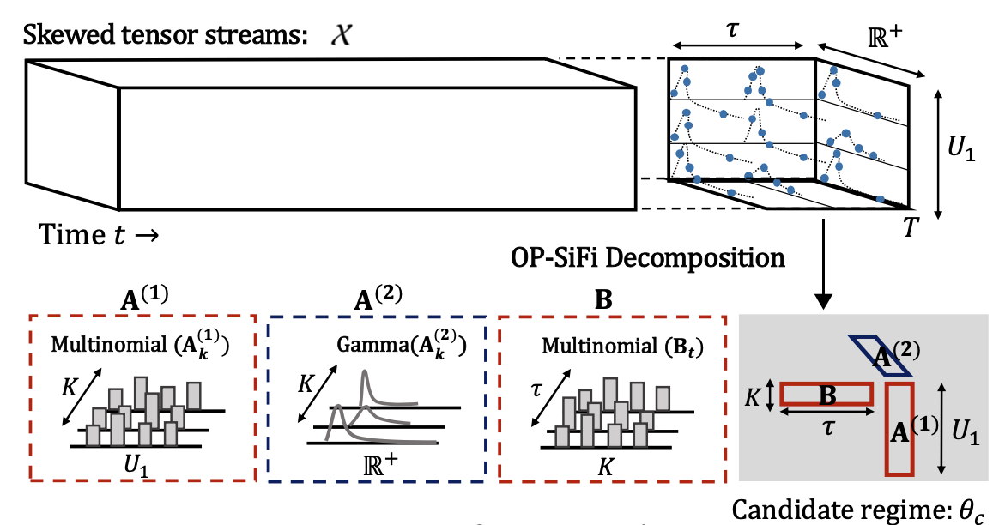
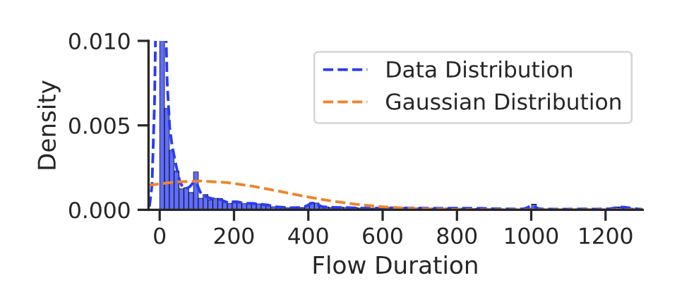

# CyberCScope

Implementation of [CyberCScope]().

CyberCScope: Mining Skewed Tensor Streams and Online Anomaly Detection in Cybersecurity Systems.\
Kota Nakamura, Koki Kawabata, Shungo Tanaka, Yasuko Matsubara, Yasushi Sakurai.  
The Web Conference 2025 short research paper.

 CyberCScope is freely available for non-commercial purposes. 
 If you intend to use CyberCScope for a commercial purpose, please contact us by email at [kotaNakm0317@gmail.com]

## Quick demo
    # Quick demo for partial data of CCI'18
    $ sh demo.sh

## Input for CyberCScope
Pandas.DataFrame  
Time + Categorical attributes + (Skewed) Continuous attributes

0| Time | Attribute1 | Attribute2 | Attribute3 | Attribute4 | ...  
1|                                :  
2|                                :  
3|                                :  

> [!NOTE]  
> The method can flexibly handle both categorical and continuous attributes.  
> It can handle skewness in the continuous attributes.

## Datasets
* [CI'17](https://drive.google.com/file/d/1yjNbQOhA_A4P88bLFCVHIL5eW5tJ1zNg/view?usp=drive_link)
* [CCI'18](https://drive.google.com/file/d/113vZifexP2ggPjALXOWet3Q5IglMyUXQ/view?usp=drive_link)
